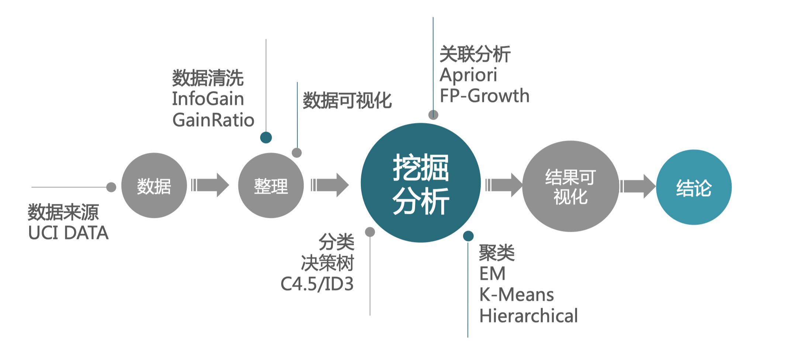
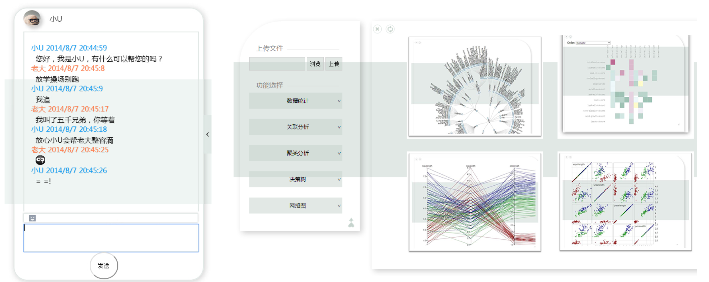
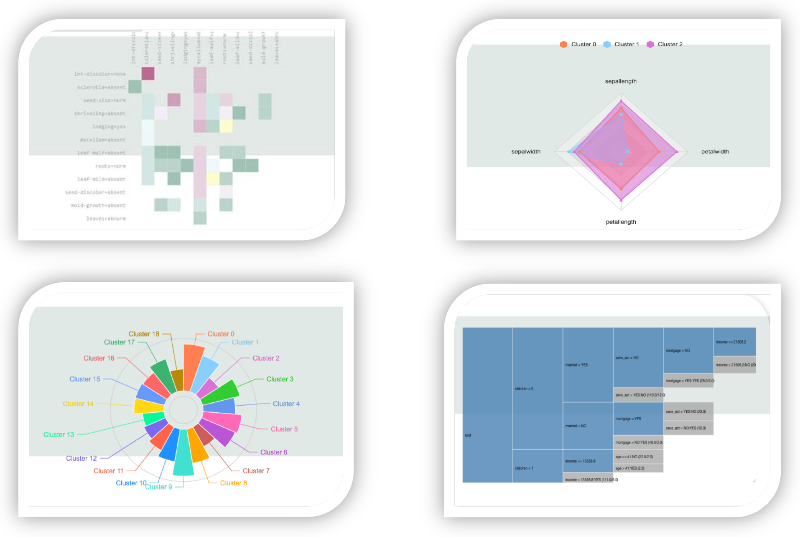

# Visual-Art-Weka

## An Interactive Web Visualization Tools
This project is based on the Weka data-mining library and D3/Echarts javascript charts, which supports several clustering, classification and association algorithms. We rewrited the Weka library to make the algorithms ouputs suitable for D3 and Echart (see the file, ./WebRoot/WEB-INF/lib/weka.jar).
End-users can use this software to analyze and visualize their data (especially the UCI datasets https://archive.ics.uci.edu/ml/datasets.html).

Note that it is built six years ago, and therefore some functions may be deprecated.

## Technical Slide
You can see the technical details from this slide: Technical report.pdf

 
## Demo Video
You can also watch the youtube video for this software:
https://www.youtube.com/watch?v=Tdoyi95WvTM

